**Practicum Assignment**
**1. Please complete Practicum 1 to 3, then document the results in the form of screenshots of your work along with explanations!**
**Practcum 1**
Step 1: Type or copy the following program code into the main() function.

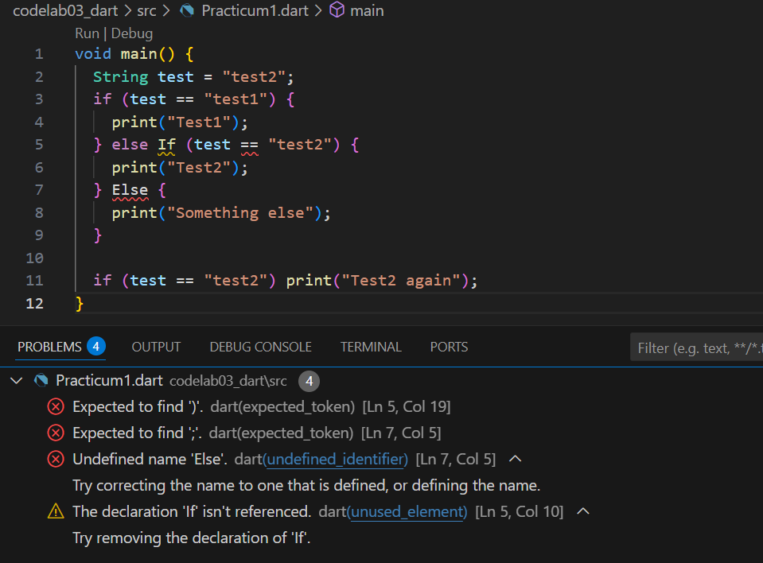

Step 2: Try to execute (Run) the code from Step 1. What happens? Explain!

There will be syntax error beacuse Dart keywords are case-sensitive and must be lowercase. Else If, Else, If with capital letters are not recognized as keywords, so the parser fails.

Fixed code:
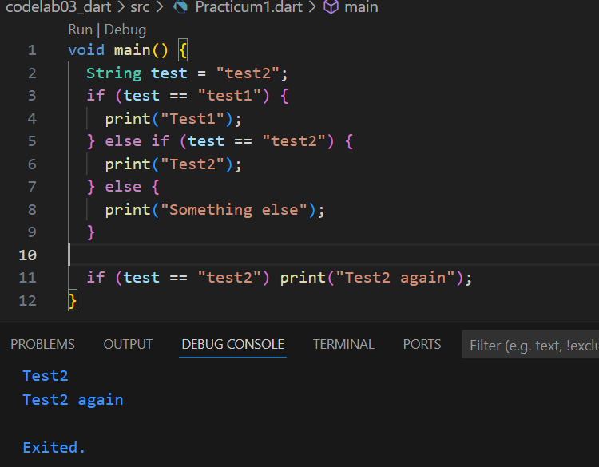

Step 3: Add the following program code, then try to execute (Run) your code. What happens? If an error occurs, fix it but still use if/else.

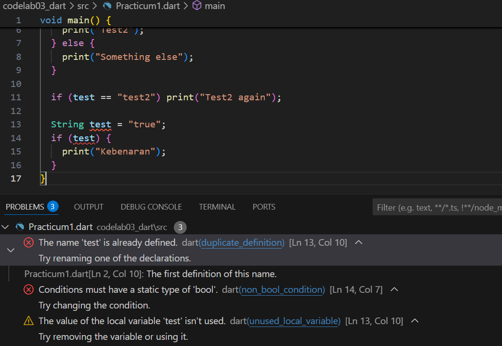

Compile-time error because a String can’t be used as a boolean condition (Dart requires a bool expression inside if(...)). I fix using test == "true" because it is a comparison expression. The operator == returns a boolean value (true or false). Since test contains "true", the comparison evaluates to true. Now the if sees a bool (as required), so the code compiles and runs.

Fixed code:
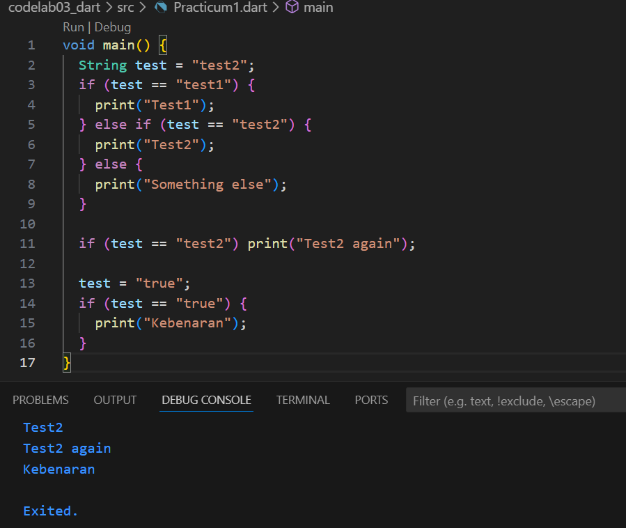

**Practcum 2**
Step 1: Type or copy the following program code into the main() function.

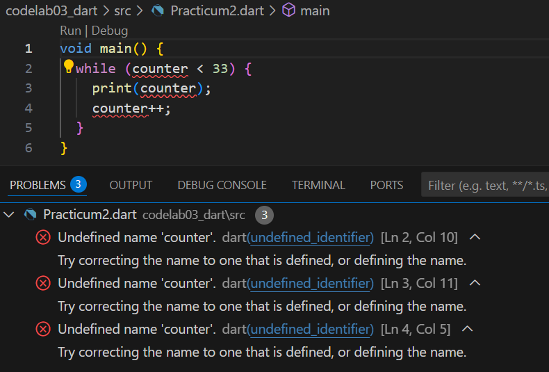

Step 2: Try to execute (Run) the code from Step 1. What happens? Explain! Then fix it if an error occurs.

Compile-time error: Undefined name 'counter' beacuse counter was never declared or initialized. To fix the code, declare and initialize before the loop.

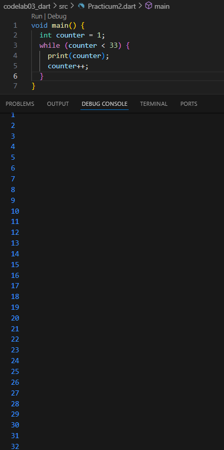

Step 3: Add the following program code, then try to execute (Run) your code. What happens? If an error occurs, fix it but still use do-while.

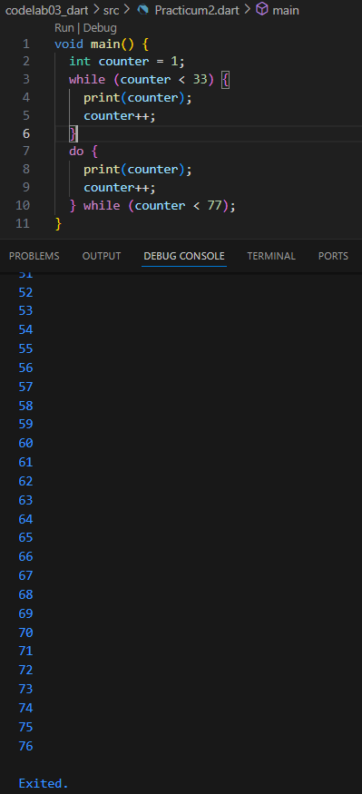

This will print 1 through 76 because do-while executes the body first then checks the condition, so it always runs at least once.

**Practcum 3**
Step 1: Type or copy the following program code into the main() function.

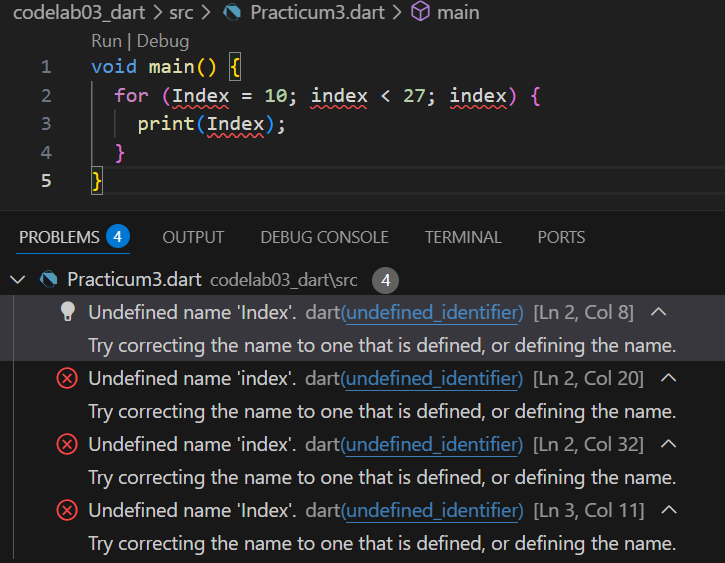

Step 2: Try to execute (Run) the code from Step 1. What happens? Explain! Then fix it if an error occurs.

Compile-time errors due to inconsistent identifier names, and missing increment (index vs Index, and index wasn’t declared, third clause should be index++).

Fixed code:
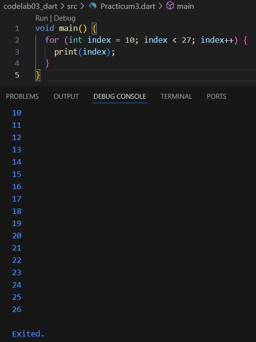

Step 3: Add the following program code inside the for loop, then try to execute (Run) your code. What happens? If an error occurs, fix it but still use for and break-continue.

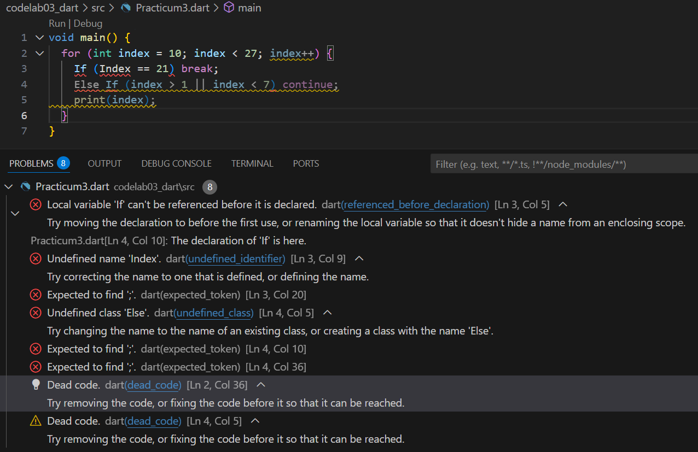

Syntax errors due to capitalized If / Else If, and logical error. index > 1 || index < 7 is usually true for most index values (because index > 1 covers most numbers >=2), so continue would skip most prints unintentionally. So, use AND (&&) to detect numbers between 2 and 6.

Fixed code:
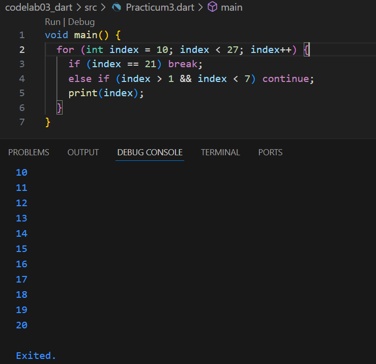

**2. Create a program that can display prime numbers from 0 to 201 using Dart. When a prime number is found, display your full name and student ID (NIM).**

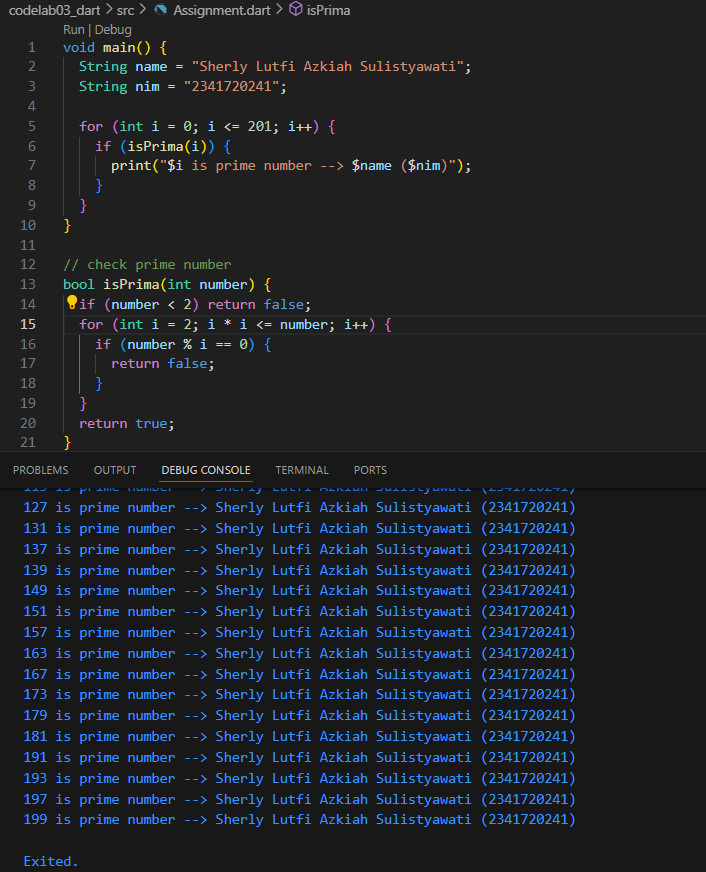

This program loops numbers from 0 to 201 and checks each one using the isPrima() function. If the number is prime, it prints the number along with my full name and NIM.