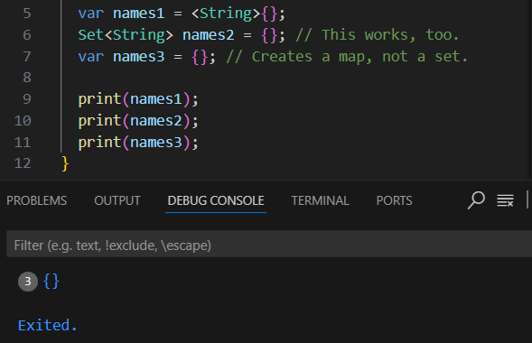
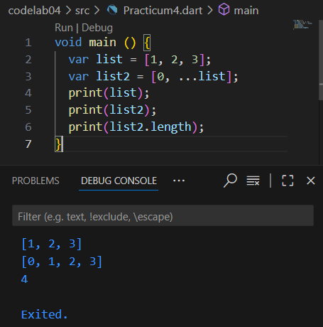

**Practicum Assignment**

**1. Please complete Practicum 1 to 5, then document the results in the form of screenshots of your work along with explanations!**

**Practicum 1**

Step 1: Type or copy the following program code into the main() function.

Step 2: Try to execute (Run) the code from Step 1. What happens? Explain!

The program displays the list length (3), the second element before modification (2), and the second element after modification (1). assert functions as a logic check at runtime (only active when run in checked mode / debug mode). Since all assert conditions are true, the program runs smoothly.

Step 3: Modify the code in Step 1 into a final variable with index = 5 and default value = null. Fill in your Name and Student ID (NIM) in index 1 and index 2. Then print and capture the result. What happens? If an error occurs, fix it.

Result: index 0 = null, index 1 = Sherly Lutfi Azkiah Sulistyawati, index 2 = 2341720241, index 3 = null, index 4 = null. final means the list cannot be reassigned to a new list (but its elements can still be modified). The data type is List<String?>.

**Practicum 2**

Step 1: Type or copy the following program code into the main() function.

Step 2: Try to execute (Run) the code from Step 1. What happens? Explain! Then fix it if an error occurs.

No error occurs because Dart automatically recognizes (type inference) that halogens is a List<String>. So, the program displays the list of halogen names in order.

Step 3: Add the following program code, then try to execute (Run) your code.

What happens? If an error occurs, please fix it but still use those three variables. Add your Name and Student ID (NIM) to the two Set variables using two different functions, namely .add() and .addAll(). For the Map variable, delete it—we will try it in the next practicum.

When executed, all {} are empty, so it looks like 3 identical rows ({}, {}, {}).

After adding elements, two variables (names1 and names2) contain data, while names3 remains empty (Map).

**Practicum 3**

Step 1: Type or copy the following program code into the main() function.

Step 2: Try to execute (Run) the code from Step 1. What happens? Explain! Then fix it if an error occurs.

No error occurs because gifts is a Map with String keys and mixed values (String and int).
nobleGases is a Map with int keys and mixed values (String and int). Dart allows a Map to contain values of different types (dynamic).

Step 3: Add the following program code, then try to execute (Run) your code.

What happens? Fix it if an error occurs.

No error occurs and it still displays the same result as before. Only two empty Maps (mhs1 and mhs2) of type Map<String, String> are added.

Then, add your Name and Student ID (NIM) into each of the variables above (gifts, nobleGases, mhs1, and mhs2). Document the results and make a report!

**Practicum 4**

Step 1: Type or copy the following program code into the main() function.

Step 2: Try to execute (Run) the code from Step 1. What happens? Explain! Then fix it if an error occurs.

When I run the code, there is an error because list1 undefined. Here's the fixed code:

I changed list1 into list.

Step 3: Add the following program code, then try to execute (Run) your code. What happens? If an error occurs, fix it.

An error occurs because list1 was never declared with a type/var.

Add a variable list containing your Student ID (NIM) using Spread Operators. Document the results and make a report!

Step 4: Add the following program code, then try to execute (Run) your code. What happens? If an error occurs, fix it. Show the results when the variable promoActive is true and false.

Previously, the code had an error because the variable promoActive was not defined.
if (promoActive) inside a list is called a collection if, which allows us to add an element to a list only if a certain condition is met.

Step 5: Add the following program code, then try to execute (Run) your code. What happens? If an error occurs, fix it. Show the result when the variable login has another condition.

Previously, there was an error because the variable login was not defined.
The syntax if (login case 'Manager') is not valid inside a list. Dart does not support if (x case 'y') directly inside a list, but it can use pattern matching or regular conditionals (if).
So, if (login == 'Manager') 'Inventory' means add the Inventory menu to the list only if the logged-in user is Manager.

Step 6: Add the following program code, then try to execute (Run) your code. What happens? If an error occurs, fix it. Explain the benefit of Collection For and document the results.

The code runs without error. listOfInts contains [1, 2, 3]. listOfStrings is created using Collection For, which means we can generate list elements dynamically with a loop directly inside the list declaration. Collection For makes it easier to create dynamic lists directly in a list literal, without having to write a manual loop outside.

**Practicum 5**

Step 1: Type or copy the following program code into the main() function.

Step 2: Try to execute (Run) the code from Step 1. What happens? Explain! Then fix it if an error occurs.
It will produce an error because the print(record) line is missing a ;. Here's the fixed code:

('first', 'last') → positional fields (access with $record.$1 or $record.$2)

a: 2, b: true → named fields (access with $record.a and $record.b)

Step 3: Add the following program code outside the main() scope, then try to execute (Run) your code. What happens? If an error occurs, fix it. Use the tukar() function inside main() to clearly show the process of swapping field values inside Records.

(int, int) → defines a record containing two integers.
var (a, b) = record; → destructures the record, so a = 10, b = 20.
tukar() function → swaps the record order, resulting in (20, 10).
So, with record + pattern matching, we can swap values more concisely without needing a temporary variable.

Step 4: Add the following program code inside the main() scope, then try to execute (Run) your code.

What happens? If an error occurs, please fix it. Initialize the name and Student ID (NIM) fields in the mahasiswa record variable above. Document the result and make a report!

mahasiswa was declared as a record of type (String, int) but was not initialized, so it cannot be printed directly.
We need to initialize the fields Name and Student ID (NIM) before using it.

Step 5: Add the following program code inside the main() scope, then try to execute (Run) your code.

What happens? If an error occurs, please fix it. 

The code runs normally.
A record can contain both positional fields ('first', 'last') and named fields (a: 2, b: true) at the same time.

Modify one of the record contents with your Name and Student ID (NIM), then document the results and make a report!

**2. Explain what is meant by Functions in Dart!**

A function in Dart is a block of code that performs a specific task, can be reused, and can optionally return a value. Functions help organize code into smaller, reusable parts.

**3. Explain the types of parameters in Functions along with example syntax!**

Dart supports several types of parameters:

1. Positional Parameters (default)

int add(int a, int b) {
  return a + b;
}
print(add(2, 3)); // 5

2. Optional Positional Parameters (inside [])

String greet(String name, [String? title]) {
  return "Hello ${title ?? ''} $name";
}
print(greet("Sherly"));         // Hello  Sherly
print(greet("Sherly", "Ms."));  // Hello Ms. Sherly

3. Named Parameters (inside {})

void printInfo({required String name, int age = 18}) {
  print("Name: $name, Age: $age");
}
printInfo(name: "Sherly");          // Name: Sherly, Age: 18
printInfo(name: "Sherly", age: 19); // Name: Sherly, Age: 19

4. Default Parameters (set with =)

void sayHello(String name, [String greeting = "Hi"]) {
  print("$greeting, $name!");
}
sayHello("Sherly");          // Hi, Sherly!
sayHello("Sherly", "Hello"); // Hello, Sherly!

**4. Explain the meaning of Functions as first-class objects along with example syntax!**

In Dart, functions are first-class objects, meaning they can be:

Assigned to variables

Passed as arguments

Returned from other functions

Example:

// Assign to variable

var sayHello = () => print("Hello!");
sayHello(); // Hello!

// Pass function as parameter

void execute(Function f) {
  f();
}
execute(sayHello);

// Return function from another function

Function multiplier(int x) {
  return (int y) => x * y;
}
var doubleIt = multiplier(2);
print(doubleIt(5)); // 10

**5. What are Anonymous Functions? Explain and provide an example!**

An anonymous function (or lambda) is a function without a name. It is often used as a short inline function.

Example:

// Normal anonymous function

var list = ['a', 'b', 'c'];
list.forEach((item) {
  print(item);
});

// Using arrow syntax (short form)

list.forEach((item) => print(item.toUpperCase()));

**6. Explain the difference between Lexical Scope and Lexical Closures! Provide an example!**

Lexical Scope: Variables are accessible based on where they are defined in the source code.

void outer() {
  var name = "Sherly";

  void inner() {
    print(name); // inner function can access outer variable
  }

  inner();
}
outer(); // Output: Sherly

Lexical Closure: A closure is a function that “remembers” variables from its lexical scope even after the outer function has finished executing.

Function counter() {
  int count = 0;

  return () {
    count++;
    return count;
  };
}

var myCounter = counter();
print(myCounter()); // 1
print(myCounter()); // 2
print(myCounter()); // 3

Here, myCounter remembers the variable count even though counter() has finished.

**7. Explain with an example how to return multiple values in Functions!**

In Dart, functions can return multiple values using:

Records (Dart 3 feature), List, Map, Class

1. Using Records:

// Function returns two values using a record

(String, int) getStudent() {
  return ('Sherly Lutfi Azkiah Sulistyawati', 2341720241);
}

void main() {
  var student = getStudent();
  print('Name: ${student.$1}, NIM: ${student.$2}');
}

2. Using List

// Function returns multiple values inside a List

List<dynamic> getStudentList() {
  return ['Sherly Lutfi Azkiah Sulistyawati', 2341720241];
}

void main() {
  var student = getStudentList();
  print('Name: ${student[0]}, NIM: ${student[1]}');
}

3. Using Map

// Function returns multiple values using a Map

Map<String, dynamic> getStudentMap() {
  return {
    'name': 'Sherly Lutfi Azkiah Sulistyawati',
    'nim': 2341720241
  };
}

void main() {
  var student = getStudentMap();
  print('Name: ${student['name']}, NIM: ${student['nim']}');
}

4. Using Class

// Define a class for student data
class Student {
  String name;
  int nim;

  Student(this.name, this.nim);
}

// Function returns an object of Student class
Student getStudentClass() {
  return Student('Sherly Lutfi Azkiah Sulistyawati', 2341720241);
}

void main() {
  var student = getStudentClass();
  print('Name: ${student.name}, NIM: ${student.nim}');
}

Output:

Name: Sherly Lutfi Azkiah Sulistyawati, NIM: 2341720241

Conclusion:

Use records if you want lightweight multiple return values (best in Dart 3+).

Use list if order matters but you don’t need named fields.

Use map if you want key-value labeling.

Use class if the data structure will be reused in multiple places.
