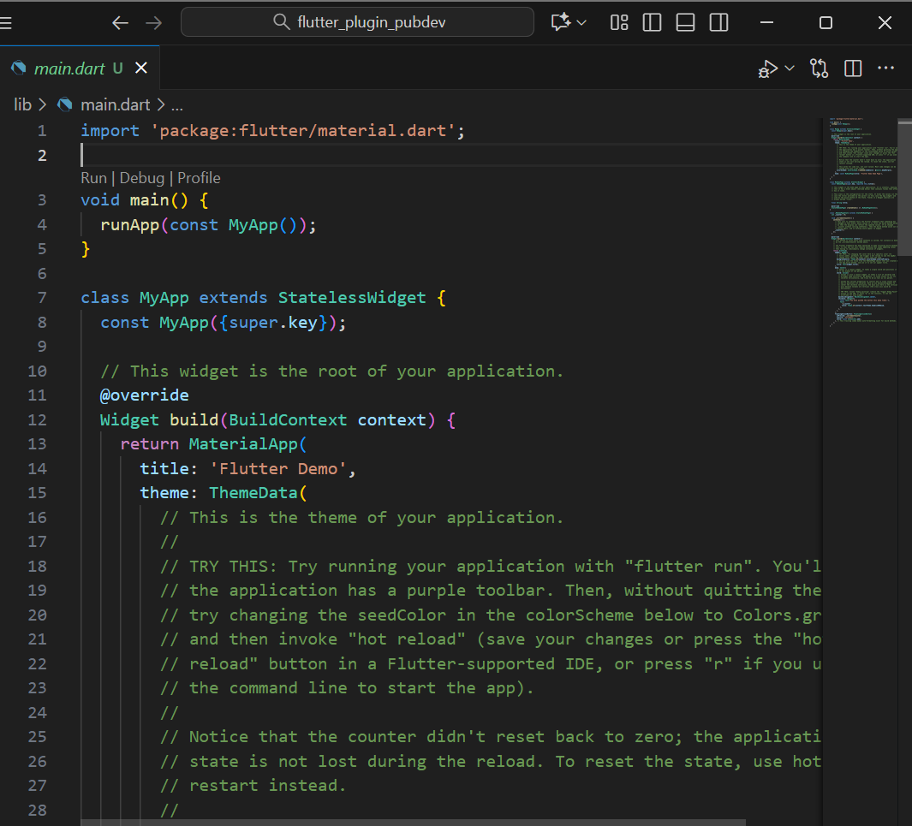
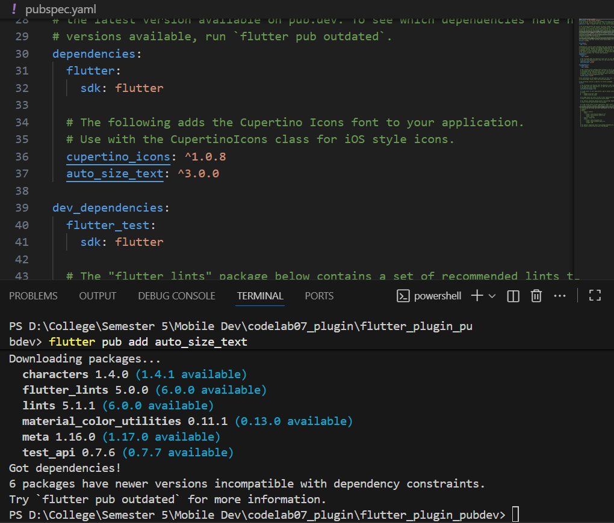
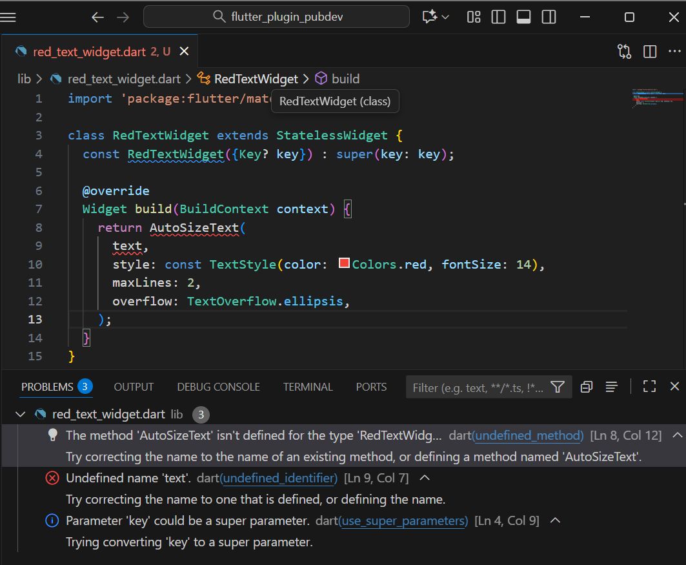
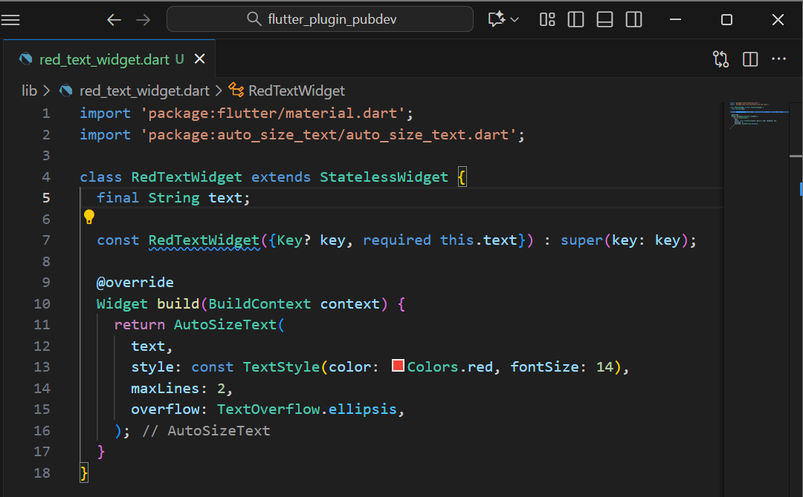

# flutter_plugin_pubdev

A new Flutter project.

## Getting Started

This project is a starting point for a Flutter application.

A few resources to get you started if this is your first Flutter project:

- [Lab: Write your first Flutter app](https://docs.flutter.dev/get-started/codelab)
- [Cookbook: Useful Flutter samples](https://docs.flutter.dev/cookbook)

For help getting started with Flutter development, view the
[online documentation](https://docs.flutter.dev/), which offers tutorials,
samples, guidance on mobile development, and a full API reference.

**Practical Assignment**

**1. Complete the practicum, then document and push it to your repository in the form of a screenshot of the work results along with an explanation in the file README.md!**

**Step 1: Create a New Project**

**Step 2: Adding Plugins**

After run the code in terminal, auto_size_text will appear in pubspec.yaml.

**Step 3: Create a filered_text_widget.dart**

**Step 4: Add AutoSizeText Widget**

After you add the code above, you'll receive an error message. Why is this? Explain it in your lab report!

The error message appears because the plugin has not been imported and the text variable is undefined in the class.

**Step 5: Create text variables and parameters in constructor**

**Step 6: Add widgets in main.dart**

**2. Explain the purpose of step 2 in the practicum!**

The purpose of adding the auto_size_text plugin to Flutter is to allows text to automatically adjust its font size to fit the width or height of its container without overflowing.

**3. Explain the purpose of step 5 in the practicum!**

The purpose is to allow RedTextWidget to receive a text value from outside via the text parameter. This makes the widget dynamic, allowing it to display different text depending on what is entered when called from main.dart.

**4. In step 6 there are two widgets added, explain their functions and differences!**

The first widget uses AutoSizeText, which automatically adjusts the font size so the text fits within the container width (50 px), while the yellow background helps visualize the container area. Meanwhile, the second widget uses the standard Text widget with a fixed font size, so if the text is too long, it may overflow or get cut off depending on the container’s width.

**5. Explain the meaning of each parameter in the plugin based on the links in this auto_size_text documentation!**

* key* → Determines how one widget replaces another in the widget tree, useful for maintaining state when rebuilding.
* textKey → Assigns a unique key specifically for the inner Text widget.
* style* → Defines the text’s appearance such as font, size, color, and weight.
* minFontSize → The smallest font size allowed when resizing text. Ignored if presetFontSizes is used.
* maxFontSize → The largest font size allowed when resizing text. Ignored if presetFontSizes is used.
* stepGranularity → Controls how smoothly the font size adjusts; smaller values give smoother resizing but can be slower.
* presetFontSizes → A predefined list of exact font sizes to use (must be in descending order). Overrides min/max limits.
* group → Links multiple AutoSizeText widgets so they share the same calculated font size, ensuring visual consistency.
* textAlign* → Sets horizontal alignment of text (e.g., left, right, center, justify).
* textDirection* → Determines reading direction (e.g., left-to-right or right-to-left), affecting how alignment is applied.
* locale* → Specifies the language and region for text rendering, which may change how certain characters appear.
* softWrap* → Decides whether the text should automatically wrap to the next line when it reaches the end.
* wrapWords → Controls whether long words are wrapped or broken when they don’t fit in a single line (default: true).
* overflow* → Defines what happens if text doesn’t fit (e.g., show ellipsis, clip, or fade).
* overflowReplacement → Widget shown when the text overflows (for example, a “Text too long” message).
* textScaleFactor* → Sets the scaling factor for text size; affects min/max font sizes and presets.
* maxLines → Limits how many lines the text can occupy; extra text is truncated if it exceeds this number.
* semanticsLabel* → Provides an alternative label for accessibility tools like screen readers.

Parameters marked with an asterisk (*) behave exactly like those in Flutter’s default Text widget.

**6. Submit your lab report in the form of a GitHub repository link to your lecturer!**
